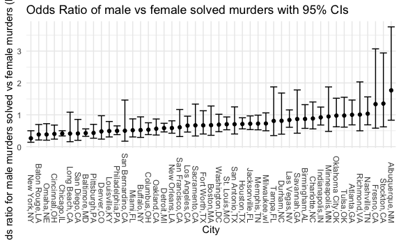
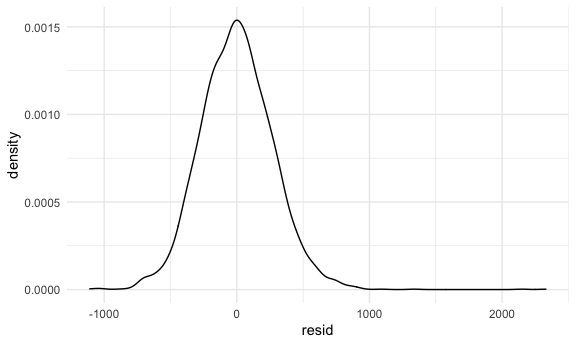
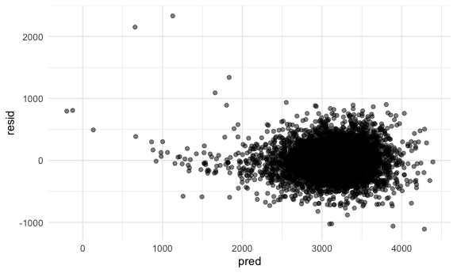
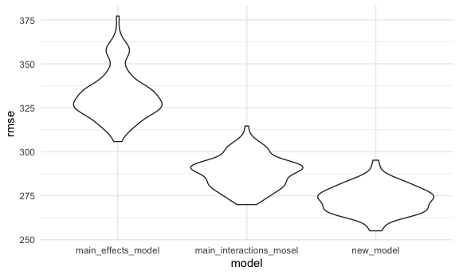

Homework 6
================
E. Brennan Bollman
December 9, 2020

``` r
library(tidyverse)
```

    ## ── Attaching packages ────────────────────────────────────────────────────── tidyverse 1.3.0 ──

    ## ✓ ggplot2 3.3.2     ✓ purrr   0.3.4
    ## ✓ tibble  3.0.3     ✓ dplyr   1.0.2
    ## ✓ tidyr   1.1.2     ✓ stringr 1.4.0
    ## ✓ readr   1.3.1     ✓ forcats 0.5.0

    ## ── Conflicts ───────────────────────────────────────────────────────── tidyverse_conflicts() ──
    ## x dplyr::filter() masks stats::filter()
    ## x dplyr::lag()    masks stats::lag()

``` r
library(patchwork)
library(stringr)
library(p8105.datasets)
library(mgcv)
```

    ## Loading required package: nlme

    ## 
    ## Attaching package: 'nlme'

    ## The following object is masked from 'package:dplyr':
    ## 
    ##     collapse

    ## This is mgcv 1.8-33. For overview type 'help("mgcv-package")'.

``` r
library(modelr)
library(purrr)
library(dplyr)

knitr::opts_chunk$set(
  fig.width = 6,
  fig.asp = .6,
  out.width = "90%"
)
theme_set(theme_minimal() + theme(legend.position = "bottom"))
options(
  ggplot2.continuous.colour = "viridis",
  ggplot2.continuous.fill = "viridis"
)
scale_colour_discrete = scale_colour_viridis_d
scale_fill_discrete = scale_fill_viridis_d

set.seed(1)
```

## Problem 1

#### Read and tidy data

``` r
homicide_df = 
  read_csv("./data/homicide-data.csv") %>% 
  mutate(
    city_state = str_c(city, state, sep = ","),
    victim_age = as.numeric(victim_age),
    resolution = case_when(
      disposition == "Closed without arrest" ~ 0,
      disposition == "Open/No arrest" ~ 0,
      disposition == "Closed by arrest" ~ 1
    )
  ) %>% 
  filter(city_state != "Tulsa,AL") %>% 
  filter(city_state != "Dallas,TX") %>% 
  filter(city_state != "Phoenix,AZ") %>% 
  filter(city_state != "Kansas City,MO") %>%
  filter(victim_race %in% c("White", "Black")) %>% 
  select(city_state, resolution, victim_age, victim_race, victim_sex)
```

    ## Parsed with column specification:
    ## cols(
    ##   uid = col_character(),
    ##   reported_date = col_double(),
    ##   victim_last = col_character(),
    ##   victim_first = col_character(),
    ##   victim_race = col_character(),
    ##   victim_age = col_character(),
    ##   victim_sex = col_character(),
    ##   city = col_character(),
    ##   state = col_character(),
    ##   lat = col_double(),
    ##   lon = col_double(),
    ##   disposition = col_character()
    ## )

    ## Warning: Problem with `mutate()` input `victim_age`.
    ## ℹ NAs introduced by coercion
    ## ℹ Input `victim_age` is `as.numeric(victim_age)`.

    ## Warning in mask$eval_all_mutate(dots[[i]]): NAs introduced by coercion

#### Step 2: Attempt regression with one city

``` r
baltimore_df = 
  homicide_df %>% 
  filter(city_state == "Baltimore,MD")

glm(resolution ~ victim_age + victim_race + victim_sex,
    data = baltimore_df,
    family = binomial()) %>% 
  broom::tidy() %>% 
  mutate(
    OR = exp(estimate),
    CI_lower = exp(estimate - 1.96 * std.error),
    CI_upper = exp(estimate + 1.96 * std.error)
  ) %>% 
  select(term, OR, starts_with("CI")) %>% 
  knitr::kable(digits = 3)
```

| term              |    OR | CI\_lower | CI\_upper |
| :---------------- | ----: | --------: | --------: |
| (Intercept)       | 1.363 |     0.975 |     1.907 |
| victim\_age       | 0.993 |     0.987 |     1.000 |
| victim\_raceWhite | 2.320 |     1.648 |     3.268 |
| victim\_sexMale   | 0.426 |     0.325 |     0.558 |

#### Step 3: Iterate this logistic regression for each city

Will nest dataset, obtain df for each city, map glm over each city. Will
tidy results as tibble.

``` r
model_results_df = 
  homicide_df %>% 
  nest(data = -city_state) %>% 
  mutate(
    models = 
      map(.x = data, ~glm(resolution ~ victim_age + victim_race + victim_sex, data = .x,
                         family = binomial())),
      results = map(models, broom::tidy)
  ) %>% 
  select(city_state, results) %>% 
  unnest(results) %>% 
  mutate(
    OR = exp(estimate),
    CI_lower = exp(estimate - 1.96 * std.error),
    CI_upper = exp(estimate + 1.96 * std.error)
  ) %>% 
  select(city_state, term, OR, starts_with("CI"))
```

#### Step 4: Plot ORs for `victim_sex` for each city

``` r
model_results_df %>%
  filter(term == "victim_sexMale") %>% 
  mutate(city_state = fct_reorder(city_state, OR)) %>% 
  ggplot(aes(x = city_state, y = OR)) + 
  geom_point() + 
  geom_errorbar(aes(ymin = CI_lower, ymax = CI_upper)) + 
  theme(axis.text.x = element_text(angle = -90, vjust = 0.5, hjust=1)) + 
  labs(
    title = "Odds Ratio of male vs female solved murders with 95% CIs",
    x = "City",
    y = "Odds ratio for male murders solved vs female murders (logistic regression)"
  )
```



Homicides in which the victim is male generally have OR estimate \<1, in
that male victims of homicide are less likely to be solved by arrest
compared to female victims of homicide in most cities. By contrast,
male-victim homicides are more likely to be solved by arrest than
female-victim homicides in Albuqurque, Stockton CA, and Fresno (OR \>1).

## Problem 2

#### Step 1: Read and tidy data

``` r
birthweight_df = 
  read_csv("./data/birthweight.csv") %>% 
  janitor::clean_names() %>% 
  mutate(
    babysex = as.factor(babysex),
    frace = as.factor(frace),
    malform = as.factor(malform),
    mrace = as.factor(mrace)
  )
```

    ## Parsed with column specification:
    ## cols(
    ##   .default = col_double()
    ## )

    ## See spec(...) for full column specifications.

Note: in cleaning df, recoded categorical variables to factors, but
intentionally left factors numeric rather than character because the
numeric factor coding made sense. There are certainly problems with
using “White” as a reference group; however, literature supports worse
obstetric and neonatal outcomes for Black people and other people of
color. Therefore, did not want these indicator variables to be coded
alphabetically in model, and other approaches (such as based on
frequency) did not make sense.

#### Step 2: Propose model

To work through this problem in a stepwise manner, will trial building
model based off prior medical learning (as an emergency physician) and
quick literature searches. Must include `gaweeks`, `bhead` and `blength`
since other baby size parameters likely related to birthweight.

Note: mother size incorporated using `ppbmi`. Did not include `ppwt` and
`mheight` as too similar. Also, `pnumsga` felt to be too similar to
`pnumlbw` so only one was used.

``` r
initial_model = lm(bwt ~ gaweeks + bhead + blength + babysex + delwt + fincome + frace + malform + momage + mrace + pnumlbw + ppbmi + smoken + wtgain, data = birthweight_df)

summary(initial_model)
```

    ## 
    ## Call:
    ## lm(formula = bwt ~ gaweeks + bhead + blength + babysex + delwt + 
    ##     fincome + frace + malform + momage + mrace + pnumlbw + ppbmi + 
    ##     smoken + wtgain, data = birthweight_df)
    ## 
    ## Residuals:
    ##      Min       1Q   Median       3Q      Max 
    ## -1091.92  -184.37    -4.29   174.40  2352.97 
    ## 
    ## Coefficients: (1 not defined because of singularities)
    ##               Estimate Std. Error t value Pr(>|t|)    
    ## (Intercept) -5685.9255   103.1237 -55.137  < 2e-16 ***
    ## gaweeks        11.2529     1.4612   7.701 1.66e-14 ***
    ## bhead         130.9434     3.4517  37.936  < 2e-16 ***
    ## blength        74.9750     2.0219  37.082  < 2e-16 ***
    ## babysex2       29.2983     8.4662   3.461 0.000544 ***
    ## delwt           3.0052     0.4138   7.263 4.47e-13 ***
    ## fincome         0.2920     0.1792   1.630 0.103190    
    ## frace2         13.4002    46.1594   0.290 0.771599    
    ## frace3         19.2140    69.3280   0.277 0.781681    
    ## frace4        -49.5413    44.6770  -1.109 0.267546    
    ## frace8          4.0860    74.1082   0.055 0.956033    
    ## malform1        9.4155    70.6574   0.133 0.893997    
    ## momage          0.7085     1.1971   0.592 0.553985    
    ## mrace2       -151.0116    46.0651  -3.278 0.001053 ** 
    ## mrace3        -95.4794    71.9191  -1.328 0.184382    
    ## mrace4        -56.7143    45.1469  -1.256 0.209105    
    ## pnumlbw             NA         NA      NA       NA    
    ## ppbmi          -9.1140     2.5812  -3.531 0.000418 ***
    ## smoken         -4.8780     0.5872  -8.307  < 2e-16 ***
    ## wtgain          1.1447     0.5730   1.998 0.045805 *  
    ## ---
    ## Signif. codes:  0 '***' 0.001 '**' 0.01 '*' 0.05 '.' 0.1 ' ' 1
    ## 
    ## Residual standard error: 272.6 on 4323 degrees of freedom
    ## Multiple R-squared:  0.7178, Adjusted R-squared:  0.7166 
    ## F-statistic: 610.9 on 18 and 4323 DF,  p-value: < 2.2e-16

``` r
broom::glance(initial_model)
```

    ## # A tibble: 1 x 12
    ##   r.squared adj.r.squared sigma statistic p.value    df  logLik    AIC    BIC
    ##       <dbl>         <dbl> <dbl>     <dbl>   <dbl> <dbl>   <dbl>  <dbl>  <dbl>
    ## 1     0.718         0.717  273.      611.       0    18 -30502. 61044. 61171.
    ## # … with 3 more variables: deviance <dbl>, df.residual <int>, nobs <int>

Note: `pnumlbw` is NA in this model. When examining data, all
observations are 0 for both `pnumlbw` and `pnumsga` so omitted these.

Non-significant variables (removed): `fincome`, `frace`, `malform`,
`momage`. `wtgain` is not highly significant, so will exclude also.
`mrace` only significant for Black mothers versus White mothers (as
expected), but will keep entire category.

``` r
new_model = lm(bwt ~ gaweeks + bhead + blength + babysex + delwt + mrace + ppbmi + smoken, data = birthweight_df)

summary(new_model)
```

    ## 
    ## Call:
    ## lm(formula = bwt ~ gaweeks + bhead + blength + babysex + delwt + 
    ##     mrace + ppbmi + smoken, data = birthweight_df)
    ## 
    ## Residuals:
    ##      Min       1Q   Median       3Q      Max 
    ## -1108.51  -182.60    -4.38   176.49  2330.33 
    ## 
    ## Coefficients:
    ##               Estimate Std. Error t value Pr(>|t|)    
    ## (Intercept) -5660.2709   101.1068 -55.983  < 2e-16 ***
    ## gaweeks        11.5615     1.4556   7.943 2.50e-15 ***
    ## bhead         131.4151     3.4459  38.136  < 2e-16 ***
    ## blength        74.7141     2.0190  37.006  < 2e-16 ***
    ## babysex2       28.4315     8.4566   3.362  0.00078 ***
    ## delwt           3.6250     0.2844  12.747  < 2e-16 ***
    ## mrace2       -144.5198     9.2110 -15.690  < 2e-16 ***
    ## mrace3        -77.6223    42.3093  -1.835  0.06663 .  
    ## mrace4       -102.6952    18.8704  -5.442 5.56e-08 ***
    ## ppbmi         -12.5945     1.9171  -6.570 5.64e-11 ***
    ## smoken         -4.8843     0.5860  -8.335  < 2e-16 ***
    ## ---
    ## Signif. codes:  0 '***' 0.001 '**' 0.01 '*' 0.05 '.' 0.1 ' ' 1
    ## 
    ## Residual standard error: 272.6 on 4331 degrees of freedom
    ## Multiple R-squared:  0.7173, Adjusted R-squared:  0.7166 
    ## F-statistic:  1099 on 10 and 4331 DF,  p-value: < 2.2e-16

``` r
broom::tidy(new_model) %>% 
  select(-std.error, -statistic) %>% 
  knitr::kable()
```

| term        |      estimate |   p.value |
| :---------- | ------------: | --------: |
| (Intercept) | \-5660.270919 | 0.0000000 |
| gaweeks     |     11.561499 | 0.0000000 |
| bhead       |    131.415106 | 0.0000000 |
| blength     |     74.714065 | 0.0000000 |
| babysex2    |     28.431537 | 0.0007803 |
| delwt       |      3.624950 | 0.0000000 |
| mrace2      |  \-144.519768 | 0.0000000 |
| mrace3      |   \-77.622267 | 0.0666281 |
| mrace4      |  \-102.695180 | 0.0000001 |
| ppbmi       |   \-12.594548 | 0.0000000 |
| smoken      |    \-4.884286 | 0.0000000 |

Note: removing the above variables does not change R-squared. All values
remain significant in new model.

#### Step 3: Plot Residuals

First look at distribution of residuals.

``` r
birthweight_df %>% 
  add_residuals(new_model) %>% 
  ggplot(aes(x = resid)) + 
  geom_density()
```



Unfortunately, residuals have some right skew.

Next look at residuals versus predictors (parameter values).

``` r
birthweight_df %>% 
  add_predictions(new_model) %>% 
  add_residuals(new_model) %>% 
  ggplot(aes(x = pred, y = resid)) + 
  geom_point(alpha = 0.5)
```



There are definitely outliers in this distribution, but most points fit
within a nice cluster, so will move forward with this model.

#### Step 4: Cross validation with other models

First, quickly look at other proposed models.

``` r
main_effects_model = lm(bwt ~ blength + gaweeks, data = birthweight_df)

broom::tidy(main_effects_model)
```

    ## # A tibble: 3 x 5
    ##   term        estimate std.error statistic  p.value
    ##   <chr>          <dbl>     <dbl>     <dbl>    <dbl>
    ## 1 (Intercept)  -4348.      98.0      -44.4 0.      
    ## 2 blength        129.       1.99      64.6 0.      
    ## 3 gaweeks         27.0      1.72      15.7 2.36e-54

``` r
main_interactions_model = lm(bwt ~ babysex * bhead * blength, data = birthweight_df)

broom::tidy(main_interactions_model)
```

    ## # A tibble: 8 x 5
    ##   term                    estimate std.error statistic      p.value
    ##   <chr>                      <dbl>     <dbl>     <dbl>        <dbl>
    ## 1 (Intercept)            -7177.     1265.       -5.67  0.0000000149
    ## 2 babysex2                6375.     1678.        3.80  0.000147    
    ## 3 bhead                    182.       38.1       4.78  0.00000184  
    ## 4 blength                  102.       26.2       3.90  0.0000992   
    ## 5 babysex2:bhead          -198.       51.1      -3.88  0.000105    
    ## 6 babysex2:blength        -124.       35.1      -3.52  0.000429    
    ## 7 bhead:blength             -0.554     0.780    -0.710 0.478       
    ## 8 babysex2:bhead:blength     3.88      1.06      3.67  0.000245

Next, build cross validation df.

``` r
cv_samp_df = 
  crossv_mc(birthweight_df, 100) %>% 
  mutate(train = map(train, as_tibble),
         test = map(test, as_tibble))
```

``` r
cross_validation_df = 
  cv_samp_df %>% 
  mutate(
    new_model = map(.x = train, ~lm(bwt ~ gaweeks + bhead + blength + babysex + delwt + mrace + ppbmi + smoken, data = .x)),
    main_effects_model = map(.x = train, ~lm(bwt ~ blength + gaweeks, data = .x)),
    main_interactions_model = map(.x = train, ~lm(bwt ~ babysex * bhead * blength, data = .x))
  ) %>% 
  mutate(
    rmse_new_model = map2_dbl(.x = new_model, .y = test, ~rmse(model = .x, data = .y)),
    rmse_main_effects_model = map2_dbl(.x = main_effects_model, .y = test, ~rmse(model = .x, data = .y)),
    rmse_main_interactions_mosel = map2_dbl(.x = main_interactions_model, .y = test, ~rmse(model = .x, data = .y))
  )
```

#### Step 5: Compare models

Plot RMSE and compute averages

``` r
cross_validation_df %>% 
  select(starts_with("rmse")) %>% 
  pivot_longer(
    everything(),
    names_to = "model",
    values_to = "rmse",
    names_prefix = "rmse_"
  ) %>% 
  ggplot(aes(x = model, y = rmse)) + 
  geom_violin()
```



``` r
cross_validation_df %>% 
  select(starts_with("rmse")) %>% 
  pivot_longer(
    everything(),
    names_to = "model",
    values_to = "rmse",
    names_prefix = "rmse_"
  ) %>% 
  group_by(model) %>% 
  summarise(avg_rmse = mean(rmse)) %>% 
  knitr::kable()
```

    ## `summarise()` ungrouping output (override with `.groups` argument)

| model                     | avg\_rmse |
| :------------------------ | --------: |
| main\_effects\_model      |  332.2287 |
| main\_interactions\_mosel |  288.6030 |
| new\_model                |  273.0061 |

The `new_model` created via rational, literature-based hypothesis of
predictors of low birthweights performs best with the lowest rmse.
Interesting, `main_interactions` also performs relatively well, but
given that this model is not based off any rational hypothesis, would
choose `new_model`
